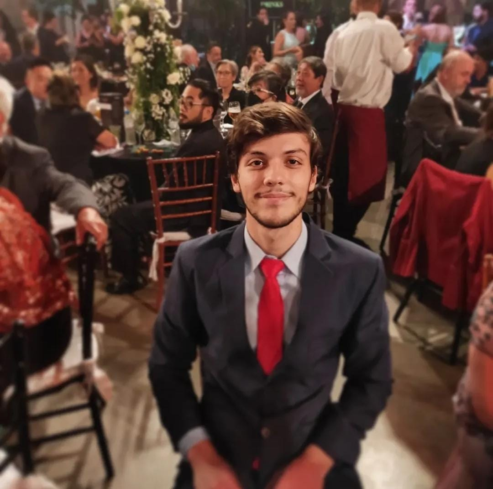

<h1 align="left">Hey 👋 What's up?</h1>

###

My name is ... and I'm a ..., from ....

###

<h2 align="left">About me</h2>

###

✨ Creating bugs since ... 📚 I'm currently learning ... 🎯 Goals: ... 🎲 Fun fact: ...

###

<h2 align="left">I code with</h2>

###

    
  
    
  

###
<h2 align="left">My social media</h2>

###

  
  
  
  
  
  

###

###

  
  

###

  

###
